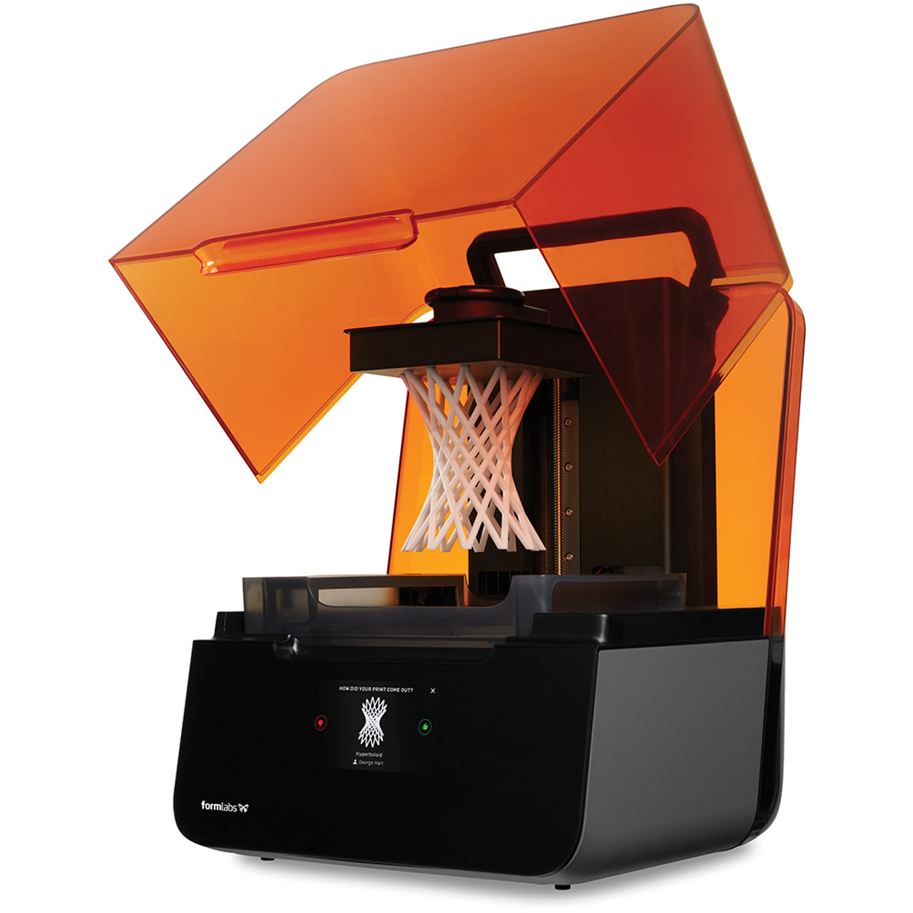

# 1. Overview
## Embedded Rockfall Detection System Using TinyML with Real-Time, 3-Component Accelerometer and Gyroscope Data 

## Authors
**Ahmed, Ahmed**
**Deal, Ethan**
**Ding, Yidan**

## Abstract

This project focuses on developing a lightweight, embedded system for real-time rockfall detection using an Arduino 33 BLE sensor equipped with a TinyML shield. A three-axis accelerometer and gyroscope were used to record vibrations caused by simulated rockfalls in a soil-filled bin inclined at 45°. The dataset consisted of 100 rockfall events and 100 background noise events, each sampled for 1.5 seconds at 100 Hz. An 80/20 training/testing split was applied, and spectral features were extracted using FFT preprocessing. A neural network with a 78-feature input layer, two dense layers (20 and 10 neurons), and a binary output layer was trained and tested, achieving an accuracy of 96.67% on the testing data. The model was deployed to the Arduino board, housed in a custom 3D-printed enclosure. A red LED flashes when rockfall events are detected, showcasing a real-time implementation of the model. Future work includes field validation, expanding datasets, and testing in varied environmental conditions for improved robustness and applicability.

## Metadata Overview

**Main Design Files**:  
- [Arduino Library](Code/rockfallmodelinferencing.zip)
- [Arduino Code](Code/rockfull_with_airetLED_external.ino)
- [CAD Files](CAD_Files)
- [Formlabs Files](Preform_Design)

**Target Group**:  
This project is suitable for individuals with intermediate to advanced technical backgrounds, such as undergraduate students, scientists, or engineers with experience in digital signal processing and machine learning. It may also interest hobbyists with strong programming and electronics skills.

**Skills Required**:
- **3D Printing**: *Easy* – The enclosure can be printed using a desktop 3D printer (e.g., Formlabs 3+ with Draft V2 photopolymer resin) with minimal setup and post-processing required.
- **Arduino Code Implementation**: *Easy* – Running pre-written code on the Arduino Nano 33 BLE is straightforward for anyone familiar with Arduino IDE.
- **Data Collection and Processing**: *Advanced* – Requires specialized knowledge in digital signal processing and machine learning, particularly in working with neural networks and using platforms like Edge Impulse to train and deploy models.
- **Hardware Assembly**: *Easy* – Involves simple assembly steps such as securing components in a 3D-printed enclosure and connecting sensors with pre-soldered headers.

## Keywords
TinyML; Rockfall Detection; Accelerometer; Edge Impulse; Real-Time Monitoring

## Introduction
Rockfalls are significant natural hazards in mountainous regions, often causing extensive damage and posing risks to human life and infrastructure. For instance, in November 2004, a major rockfall of approximately 1,500 cubic yards caused significant damage to Interstate-70 at mile-marker 125 in Glenwood Canyon, Colorado. Traditional methods for detecting and monitoring rockfalls, such as visual inspections and seismic monitoring, have various limitations, including high operational costs and poor real-time capabilities. Visual inspections, while essential, are subjective and heavily dependent on the expertise and perspective of the observer. Seismic monitoring, on the other hand, provides valuable data but can be complex and costly to maintain over large areas. Terrestrial Laser Scanning (TLS) has emerged as one of the most advanced techniques for monitoring and analyzing rockfalls due to its ability to produce high-resolution, accurate digital terrain models, which are crucial for evaluating rockfall trajectories and characteristics. This method has proven effective in identifying and quantifying rockfalls, allowing for better prediction and mitigation strategies [1]. Also, Photogrammetry, specifically Structure-from-Motion (SfM), has been utilized to monitor rockfalls by creating detailed 3D models from photographs. This method is particularly useful for documenting rockfall occurrences over long periods and assessing changes in rockfall frequency and volume [2]. Fiber optic sensing, another innovative approach, utilizes Distributed Acoustic Sensing (DAS) systems that can detect and locate rockfalls along linear infrastructures. These systems analyze the acoustic signals transmitted through fiber optic cables to pinpoint rockfall events, offering a real-time monitoring solution that complements other detection methods [1].

Recent advancements in machine learning, particularly the use of Tiny Machine Learning (TinyML) on low-power devices, offer new possibilities for enhancing rockfall detection systems. These intelligent frameworks integrate various machine learning models to handle real-time data efficiently, providing timely responses to potential rockfall events. This approach promises significant improvements over traditional methods by lowering costs, reducing energy consumption, and increasing the scalability of rockfall monitoring systems [3]. The integration of TinyML with sensors such as accelerometers and gyroscopes allow for the development of compact, efficient systems capable of detecting rockfalls in real-time. This technology not only streamlines the process of monitoring rock slopes but also enhances the safety measures by providing immediate data directly from the affected areas. By leveraging these advanced technologies, it is possible to develop more reliable, efficient, and cost-effective solutions for rockfall monitoring, which is essential for enhancing safety measures and reducing the risk to human lives and infrastructure. This manuscript will delve into the implementation of such a system, highlighting its design, operational benefits, and the potential it holds for transforming rockfall detection practices.

## Overall Implementation and Design
The proposed rockfall detection system utilizes the Arduino Nano 33 BLE Sense board, equipped with a 9-axis inertial measurement unit (IMU) comprising a 3D accelerometer, 3D gyroscope, and 3D magnetometer. The IMU captures motion data across three axes, which is processed using TinyML models deployed on the microcontroller. The system is designed to detect specific motion patterns indicative of rockfall events.

*Figure x: Final Design*

Hardware Components:
- **Microcontroller**: Arduino Nano 33 BLE Sense
- **Sensors**: Onboard 9-axis IMU (accelerometer, gyroscope, magnetometer)
- **Power Supply**: Rechargeable battery pack
- **Communication Module**: Bluetooth Low Energy (BLE) for data transmission

*Figure x: Arduino 33 BLE Sense Board*

Software Components:
- **Data Collection**: Utilizing Arduino libraries to interface with IMU sensors
- **Model Training**: Data collected is used to train machine learning models on platforms like Edge Impulse
- **Model Deployment**: Trained models are converted to TensorFlow Lite format and deployed on the microcontroller
- **Real-Time Inference**: The microcontroller processes incoming sensor data to detect rockfall events

# 2. Quality Control
## Safety
This project poses no significant safety risks. The [Arduino Nano 33 BLE](https://store-usa.arduino.cc/products/arduino-nano-33-ble?srsltid=AfmBOor4lODWf1WTLHpO6Rsf4GWOvRnjMUOSqRXO_J06y5ka-2iJ5dO2) board operates at a maximum voltage of 3 V. The only potential concern is the scale of the simulated rockfalls. However, our rockfall experiments were conducted on a very small scale, mitigating this risk.

## Calibration
The reliability of measurements in this hardware setup depends on proper coupling between the TinyML Shield and the soil. To ensure accurate wave transmission from rockfalls to the accelerometer and gyroscope, the shield must be buried securely, with the soil packed firmly around it. Adding a small amount of water can further enhance soil compaction and improve signal transmission. Users are advised to test different burial depths, shield locations, soil packing methods, and moisture levels to optimize data quality before beginning actual data collection. Edge Impulse enables rapid data visualization, allowing users to evaluate these adjustments efficiently.

## General Testing
The final hardware design measures 4x2.5x1.125 inches, housing an Arduino Nano 33 BLE board that is compact at only 2x0.5x0.5 inches. While the enclosure is functional, it is not inherently water-tight unless the openings in the 3D-printed case are sealed. To protect the design during testing, a thin plastic bag was placed around the entire assembly before burial, preventing moisture and dirt contamination. For real-world applications, this design would need to be upgraded with a fully sealed and water-tight enclosure to ensure durability in harsh conditions. Additionally, the current enclosure may be vulnerable to damage from larger rocks, which could crush critical components. To address this, a sturdier container would be required in practical implementations to withstand high-impact forces and maintain the integrity of the hardware.

# 3. Application
## Use Cases

A link to the Edge Impulse project that includes the collected data and processing, and training the neural network. 
https://studio.edgeimpulse.com/public/575131/live

### Data Collection Process

### Objective
The goal is to detect rockfall events in real-time using a lightweight embedded system with a three-axis accelerometer and gyroscope.

### Hardware Setup
- **Arduino Nano 33 BLE**: Equipped with TinyML capabilities.
- **Three-axis accelerometer and gyroscope**: Used to record vibrations.
- **Experimental Setup**: A soil-filled bin inclined at 45° to simulate rockfalls.

### Data Acquisition
- **Events Recorded**:
  - **Rockfall Events**: Simulated by dropping rocks into the soil-filled bin.
  - **Background Noise Events**: Captured during periods without any rockfall activity.
- **Sampling Rate**: Data is sampled at 100 Hz.
- **Duration**: Each event is recorded for 1.5 seconds.
- **Dataset Size**:
  - 100 rockfall events.
  - 200 background noise events.

### Preprocessing
Raw accelerometer and gyroscope data are transformed into spectral features using **FFT (Fast Fourier Transform)** preprocessing.

### Data Splitting
The dataset is split into **80% training data** and **20% testing data**.

### Deployment
After training the neural network, the model is deployed to the Arduino board housed in a custom 3D-printed enclosure.

*Figure x: Experimental Setup*

# 4. Build Details
## Availability of Materials and Methods
While the [Arduino Nano 33 BLE](https://store-usa.arduino.cc/products/arduino-nano-33-ble?srsltid=AfmBOor4lODWf1WTLHpO6Rsf4GWOvRnjMUOSqRXO_J06y5ka-2iJ5dO2) and [TinyML Shield](https://store-usa.arduino.cc/products/arduino-tiny-machine-learning-kit?srsltid=AfmBOoojrt-4hQ4G9KjtIXiajwsGtXGNaIXXYTDAT1c_LlG9_NxYmcPi) are widely available through global distributors, the use of a Formlabs 3+ printer with proprietary  [Draft V2 photopolymer resin](https://formlabs.com/store/materials/draft-v2-resin/) provides a specialized solution for creating high-quality enclosures. These materials and methods are suitable for replicable construction but may require access to advanced 3D printing facilities. The use of only accelerometer and gyroscope data focuses the hardware's functionality on motion-related metrics, aligning with the project’s specific objectives.

*Figure x: Formlabs 3+ Printer used for the project*

## Ease of Build / Design Decision 
The system is designed for ease of assembly, utilizing off-the-shelf components and open-source software tools. Design decisions focus on minimizing cost and power consumption while ensuring reliable detection capabilities. 

## Operating Software and Peripherals
If hardware requires software, details on the operating software and programming language - Please include minimum version compatibility. Additional system requirements, e.g. memory, disk space, processor, input or output devices. 
If the hardware does not require software, detail any required supporting processes or protocols required for use.  

## Dependencies
The system relies on the Arduino development environment and libraries for sensor interfacing, as well as machine learning frameworks like TensorFlow Lite for model deployment. All dependencies are open-source and compatible with the hardware components used.

## Hardware Documentation / Build Instructions / Files Location

The hardware for this project was constructed using an [Arduino Nano 33 BLE](https://store-usa.arduino.cc/products/arduino-nano-33-ble?srsltid=AfmBOor4lODWf1WTLHpO6Rsf4GWOvRnjMUOSqRXO_J06y5ka-2iJ5dO2) board and a [TinyML Shield](https://store-usa.arduino.cc/products/arduino-tiny-machine-learning-kit?srsltid=AfmBOoojrt-4hQ4G9KjtIXiajwsGtXGNaIXXYTDAT1c_LlG9_NxYmcPi). A custom enclosure was designed using CAD software and 3D printed with a [Formlabs 3+](https://formlabs.com/3d-printers/form-3/?srsltid=AfmBOoogctzvkMCPNXJxEQaeboXhmlPcaZkhTJMcOLzRIGzMOPJLnxxH) printer using [Draft V2 photopolymer resin](https://formlabs.com/store/materials/draft-v2-resin/). This process involved slicing the CAD design for high-resolution rapid prototyping and ensuring the final print provided a precise fit for the components.

*Figure x: 3D Printed Top Piece*

To assemble the hardware:
1. **Print the Enclosure**: Use the provided CAD files to 3D print the enclosure. Ensure the dimensions align with the specified 4x2.5x1.125 inches.
- [CAD Files](CAD_Files)
- [Formlabs Files](Preform_Design)
2. **Prepare the Components**: Gather the [Arduino Nano 33 BLE](https://store-usa.arduino.cc/products/arduino-nano-33-ble?srsltid=AfmBOor4lODWf1WTLHpO6Rsf4GWOvRnjMUOSqRXO_J06y5ka-2iJ5dO2) board and the [TinyML Shield](https://store-usa.arduino.cc/products/arduino-tiny-machine-learning-kit?srsltid=AfmBOoojrt-4hQ4G9KjtIXiajwsGtXGNaIXXYTDAT1c_LlG9_NxYmcPi).
3. **Mount the Arduino and Shield**: Secure the TinyML Shield to the Arduino Nano 33 BLE board using pre-soldered headers to establish a reliable electrical connection.
4. **Attach Components to the Enclosure**: Place the board and shield assembly into the 3D-printed enclosure and fix it in place using standard screws. Ensure the components are tightly secured to prevent movement during operation.
5. **Seal the Enclosure (Optional)**: If operating in environments with potential moisture or dust, seal the openings of the enclosure with silicone or another sealing material. For testing, a thin plastic bag was used to protect the hardware from dirt and moisture.

*Figure x: TinyML Shield Bolted Onto 3D Printed Base*

# 5. Discussion
## Conclusions
The embedded rockfall detection system demonstrates the feasibility of using TinyML for real-time monitoring of geological hazards. Its cost-effectiveness and scalability make it a viable solution for deployment in various high-risk areas.

## Future Work
Future developments include testing the system with different materials and variables in the lab, determining the optimal number of sensors required over a given area, and conducting extensive field applications to demonstrate the method's effectiveness. Implementations in high-risk zones, for example along the I-70 corridor, incorporating solar panels and road signs with flashing lights for real-time alerts.

## Author Contributions
Task (e.g. design, assembly, use cases contribution, documentation, paper writing), contribution, author name. 

## References
[1] Dietze M, Mohadjer S, Turowski JM, Ehlers TA, Hovius N. Seismic monitoring of small alpine rockfalls – validity, precision and limitations. Earth Surf. Dynam. 2017;5:653-668. Available from: https://www.earth-surf-dynam.net/5/653/2017/.

[2] Guerin A, Stock GM, Radue MJ, Jaboyedoff M, Collins BD, Matasci B, Avdievitch N, Derron MH. Quantifying 40 years of rockfall activity in Yosemite Valley with historical Structure-from-Motion photogrammetry and terrestrial laser scanning. Geomorphology. 2020;356:107069. doi: 10.1016/j.geomorph.2020.107069.

[3] Zoumpekas T, Puig A, Salamó M, García-Sellés D, Blanco Nuñez L, Guinau M. End-to-End Intelligent Framework for Rockfall Detection. arXiv:2102.06491 [cs.LG]. 2021 Feb 12. Available from: https://arxiv.org/abs/2102.06491.

